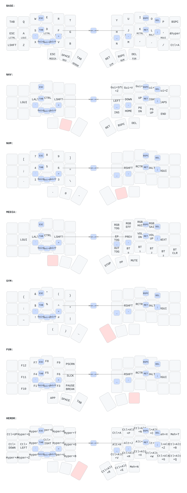

# Corne ZMK Keymap

Split ergonomic keyboard (42 keys) running [ZMK firmware](https://zmk.dev) on Nice!Nano v2.
Miryoku-style layout adapted from TOTEM config.

## Keymap

Auto-generated from [`config/corne.keymap`](config/corne.keymap) via [keymap-drawer](https://github.com/caksoylar/keymap-drawer):



The SVG updates automatically on push via the [Draw Keymap](.github/workflows/draw-keymap.yml) workflow.

## Display

The 5-pin display header carries MOSI/SDA on P0.17, SCK/SCL on P0.20 and CS on
P0.06, so the same header takes either an I2C OLED or a nice!view.

OLED builds (`corne_left` / `corne_right`):

- **Left (central):** Built-in ZMK status screen (layer, battery, BT)
- **Right (peripheral):** Custom P keycap logo with glitch effects + battery + BT status

nice!view builds (`corne_* nice_view_adapter nice_view`) use nice!view's own
160x68 status screens; the overrides live in
[`config/nice_view.conf`](config/nice_view.conf), which ZMK applies only to
builds whose shield list contains `nice_view`.

> **No RGB on this board.** The Corne V4 Pro Micro Edition has no LED
> footprints at all. A stock crkbd WS2812 chain used to be defined in
> `corne.dtsi` on P0.06 -- which is the display chip-select here -- and it
> blanked the nice!view. Do not add it back. The `&rgb_ug` keys on the media
> layer are inert.

## Interactive Viewer

```sh
make viewer
```

Press `?` for the cheat sheet. Press `0-6` to switch layers.

## Build Firmware

Push to `config/` or `build.yaml` triggers the [Build ZMK firmware](.github/workflows/build.yml) workflow. Download `.uf2` files from Actions artifacts.

## Regenerate Keymap SVG

```sh
make install   # one-time: pip install keymap-drawer
make svg       # parse + render SVG
```

## Hardware

- **PCB:** [Corne V4 Pro Micro Edition](https://github.com/klouderone/CorneV4ProMicroEdition) (Kea Workshop)
- **Board:** Nice!Nano v2 (nRF52840)
- **Shield:** Corne (split, 6x3+3)
- **Display:** OLED SSD1306 128x32 / Nice!View (shared 5-pin header)
- **RGB:** none -- this PCB has no LEDs
- **Bluetooth:** 4 profiles
- **ZMK Studio:** Enabled
- **Mouse/Pointing:** Removed (layer 6 is now HERDR: multiplexer + window management)
